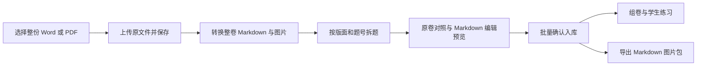

# 整卷导入与 Markdown 题库重构设计

日期：2026-09-28。状态：实施代码已进入本机未提交 worktree；生产仍运行基线，尚未部署。真实样本与阶段验收状态见[验收记录](../plans/2026-09-28-document-ingestion-acceptance.md)，不可将设计要求等同于已通过功能。

开发执行请阅读[完整施工文档](../plans/2026-09-28-document-first-question-ingestion-implementation.md)，其中包含数据库 SQL 草案、接口契约、阶段任务及验收附件。

目标：教师选择一份 Word/PDF 试题，系统自动转换为可编辑 Markdown、持久保存图片、拆分题目；教师集中复核后批量入库。学生看到重新渲染的完整题目，教师可以导出单题或整卷的 Markdown 与图片包。手工逐题录入仅保留为补充入口。

## 一、现场结论

本机 main、GitHub main、部署机 checkout/origin/main 均为 `6c79ab00fd6b54048c6cb9840ea930c2089c39c5`。恢复脚本确认自动更新定时器 active、服务运行、HTTP 200。以下数据库查询均通过 SQLite `mode=ro` 完成，没有修改生产数据。

| 已核实事实 | 证据与影响 |
| --- | --- |
| 当前教师工作台只有逐题表单 | `learning_views.py:84-96`；`server.py` 在结果制模式渲染此页面，旧教师页面的解析入口没有出现在该流程中 |
| 线上共 36 条题目记录，36 条题目图片记录；文档解析任务和导入批次均为 0 | 其中 19 条来源为“教师录入”，17 条来源为“高三第一次周测（选择题与实验填空）”；这些是按作答项拆分后的数量，不能当完整大题数 |
| 部分正文是摘要，选项是占位文字 | 线上联考题写“完整题干与选项见原题图”“原题扫描图中的 A 选项”，并非可编辑的完整题目 |
| 联考第 1 题绑定了错误图片 | `references/sep-exam-20260922/run_outcome_import.py:31-43` 将 1—4 题绑定到 `paper-left.png`；打开该图实际看到第 5、6、7 题。线上第 1—4 题图片与该文件 SHA-256 一致 |
| 旧解析器没有接收原文件字节 | `parsing.py:173-184` 把 `source_text` 以 UTF-8 写入临时文本文件；文件名不是二进制上传能力 |
| 旧拆分器损坏 Markdown 结构 | `_extract_stem` / `normalize_parser_output` 压平换行；现场最小验证中，两段正文与图片被合成一行；`1．` 全角题号样本识别为 0 题 |
| MinerU 图片没有持久化 | `parsing.py:247-262` 优先返回任意首个 JSON，没有核对其 schema，随后删除整个临时目录；Markdown 和图片也没有成为一起保存的资源包 |
| 当前展示及导出不满足目标 | 结果制页面对 stem 做 HTML 转义，再附加 `exam_assets` 图片；现有错题学习单导出不是单题 Markdown 图片包，没有共同的 Markdown 渲染路径 |

错误图片哈希：`4cd8b0bf2288b245295e15612b5d1e777819607508a396cdb3232b3f91dbbe8a`。这个证据证实联考第 1—4 题的绑定错误；第一次周测其他题的逐题错配范围尚未完成核对，不推断为全部错误。

## 二、真实样本决定转换路径

原文件现位于 `/Users/binyu/Documents/高三答题卡/`；早期来源清单的根目录路径已失效，应以本次文件定位为准。

| 样本 | 本次实测 | 处理要求 |
| --- | --- | --- |
| 第一次周测/高三第一次周测.docx | 230 个 media 文件、269 个 embeddings 文件，原生 OMML 数学节点为 0 | 旧式嵌入公式不能当普通文字丢弃；提取图片/对象关联，必要时转换为 PDF 后识别公式 |
| 第二次周测/2027届高三物理周测2.docx | 21 个 media 文件、142 个原生数学节点，无 embeddings 文件 | 保留段落、题号、选项及图片锚点，将原生公式转换为 LaTeX |
| 9月联考/【物理试卷】2027届高三供题训练.pdf | 6 页，每页可提取文字均为 0 | 必须做版面识别和 OCR，覆盖公式、多栏、跨页题；纯文本提取不能作为成功回退 |

上述文件数量是容器内文件计数，不等于不同公式或插图数量。对 Word 做了结构检查；未据此声称完整转换或视觉保真通过。

部署机可导入 MarkItDown 0.1.6、MinerU 3.4.0、mammoth、python-docx、markdown-it，存在 LibreOffice 和 mineru 命令。没有进行真实整卷转换，模型权重、耗时、内存及识别质量仍须验收。runtime readiness 的 importable 状态不足以证明这些条件。

## 三、教师实际操作



1. 教师工作台的主按钮改为“导入整份试卷”，选择 `.docx`、`.doc` 或 `.pdf`。可另外上传答案/解析文件，或在整卷中识别答案区。界面不要求教师先转文本、填解析器名称或准备 JSON 整理包。
2. 显示持久任务进度：已上传、正在识别、正在拆题、待复核、已入库。关闭页面后可继续查看；失败显示可理解的原因与重试入口。
3. 左侧是原卷页和被引用的块，右侧是题号列表及 Markdown 编辑/渲染预览。支持调整题号、合并误拆、在指定位置拆分、移动图片、修正公式、排除非题目内容。
4. 默认处理整卷。教师可集中勾选已核对题目入库；高风险项必须解决或明确暂缓，其余题可先入库，不要求教师重填每道题。
5. 入库后可编辑题目版本，预览和导出。答案缺失允许保存草稿并后补；未确认答案的题不能进入自动判对错流程。知识/能力标签候选可以批量确认，不阻塞文件转换。

## 四、内容与作答结构

**Markdown 是题目可编辑正文的真相。** 原 Word/PDF 为来源证据；整页截图只用于原卷对照。插图、实验装置、函数图像保留为独立图片，并在正文正确位置引用。正文、选项和可识别公式不得整体退化为一张截图。

建议采用结构化题目对象：`stem_md`、有序 `options_md`、`answer_md`、`analysis_md`、`children`、`asset_refs`、`source_spans`。这几个内容字段都保留原始 Markdown；整题 `question.md` 由它们确定性生成。编辑整题 Markdown 时通过固定章节结构回写同一对象，禁止维护互不一致的“显示正文”和“导出正文”。

完整大题与作答项分开：第 11 题保存公共题干、装置图、全部小问；`11.1`、`11.2` 等作答项引用父题版本及对应小问，拥有独立答案、作答和对错记录。统计可以按空，展示与导出必须携带公共上下文。试卷中主观大题同样允许转换、保存和导出；现有结果制仅支持选择/填空，不因此丢弃其他大题，也不顺带扩展主观题自动判分。

保留已有 `original_papers`、`question_import_batches`、`document_parse_tasks`、`parsed_question_items` 的职责，采用增量迁移：

| 对象 | 新增或完善字段 |
| --- | --- |
| 原始文档 | school_id、文件字节存储位置、SHA-256、真实 MIME、原文件名、页数、上传人；题卷与答案文档明确区分 |
| 转换产物 | 原卷版本、转换器版本/配置摘要、完整 document.md、版面块 JSON、资源清单、警告、产物哈希 |
| 任务 | 上传/转换/拆题状态、阶段进度、租约/心跳、重试次数、幂等键、错误类型；不要在 HTTP 请求中同步跑长 OCR |
| 题目版本 | 上述 Markdown 内容、父题/子项关系、原题号、校对状态、来源片段、资产集合、内容哈希、修订人/时间 |
| 来源片段 | 文档/页/栏/块 ID、坐标系和 bbox、阅读顺序；Word 原生定位优先使用段落和关系 ID，渲染页码另存 |
| 资源 | 不可变 asset_id、学校归属、哈希、MIME、尺寸、字节位置、原始来源、引用关系；保留共享关系但不跨学校暴露 |
| 测评快照 | 固定题目内容版本及图片版本；旧快照、首次作答、学生身份、标签和答题卡证据继续保留 |

不覆盖 `data/`；原文档和资源目录需要一起备份，不能只备份 SQLite。已有 `exam_assets` 保留，新增文档资产系统处理不同类型图片与来源定位。

## 五、转换与拆题算法

### 文档转换

- **DOCX 原生路径**：解析 OOXML 的段落、列表编号、表格、图片关系和 OMML；原生公式转 LaTeX，提取插图并保留锚点。MarkItDown 可作为文字/表格转换组件，但需要实测图片和公式覆盖率。
- **旧 Word 与嵌入公式**：受控 LibreOffice 子进程转换副本；无法可靠提取的公式进入公式识别并标记复核，不静默变成空白。转换副本与原件关系可追溯，不修改原件。
- **PDF**：检测文字层与版面；扫描件以及公式/复杂多栏页走 MinerU 的版面、OCR、公式识别链路。收集 Markdown、结构化块与图片，按已安装版本适配，不能将上游新版本 CLI/API 直接套用到 3.4.0。
- **失败处理**：明确区分转换失败、部分可读、公式待复核、无法确定拆题边界；不把零题、空文本或整页图片包装成“转换成功”。

所有转换器统一返回内部文档模型后再拆题。外部 JSON 必须做 schema 适配，不能取输出目录中第一个 JSON 就当题目列表。资源复制及引用校验成功后才清理临时目录。工作进程有文件/页数/解压后大小、时间和并发限制，重启后任务可恢复。

### 拆题与质量检查

先按页和栏恢复阅读顺序，再识别主标题/章节/大题号/小问/选项。覆盖 `1.`、`1．`、`1、`、无空格题号、自动编号；避免把小数、年份、选项和解答步骤当新题。跨页续题按块连续性和题号合并。将试题区、答案区、答题卡区分别识别，按题号关联答案。

AI 可辅助判断边界和转写，但必须返回其依据的原文块；不得补写缺失条件或根据题型猜答案。题号顺序、覆盖块、选项数量、图片引用、公式片段和答案归属都应做独立检查。原文有疑义时保留待确认。

不能直接沿用现有解析器人为加减 0.2 得出的 confidence 作为发布质量门槛。应输出可解释异常，例如“第 7 题跨页未合并”“图片没有归属”“第 3 题缺 C 选项”“公式转写未核对”。

## 六、渲染和导出

建立一个公共渲染组件，题库编辑预览、教师试卷、学生错题本、练习页和导出预览全部使用它。支持段落、列表、表格、上下标、LaTeX 行内/块公式和图片。使用受控 Markdown 渲染及本地数学资源；禁止原始脚本、事件属性和任意远程图片。内部图片引用通过有权限校验的资源接口解析，兼容站点子路径。

教师提供“下载本题 Markdown 图片包”和“下载整卷 Markdown 图片包”：

```text
第01题/
  question.md
  images/
    figure-01.png
  source.json
```

正文引用 ``。包内包含正文、选项、选择包含的答案/解析及所有实际引用资源；source.json 记录来源与版本，不带学生身份、答题卡或服务器绝对路径。普通 Markdown 阅读器在解压后应可加载图片，公式使用约定的 LaTeX 语法；验收用支持数学的本地阅读器。

服务端校验包内引用完整、没有越界路径、文件名冲突及无权资产；导出时重写相对路径。相同题目版本在页面与 ZIP 中的内容、图片哈希应一致。学生接口只返回其有权看到的内容，未开放的答案不能藏在页面源码或下载包内。第一轮保证教师导出，学生导出沿用现有发布/解析可见性规则。

## 七、现有两批题目如何修复

1. 对生产数据、资产和原件建立备份及只读清单，按考试/原题号/内容核对 36 个作答项与完整大题的映射。联考现有原题号为空，不能依靠字段或列表顺序直接批量替换。
2. 在新导入流程中重新转换原卷，生成候选内容，逐题对照。联考第 1—4 题的已证实错误作为第一批修复目标；继续核对其他题，不以文件名推断图中内容。
3. 将已确认的新内容作为题目修订版关联到旧题，维护“旧题—父题—小问—新版本”映射。显示修订可通过明确的内容纠错记录应用于历史错题页，同时允许查阅原始快照。
4. 不覆盖或重算首次作答、对错、身份、答题卡及练习记录。发现答案也有变化时单独列出，走成绩/结果复核，不借正文修复静默改判。
5. 每批迁移事务化、可回滚、幂等；校验迁移前后人数、作答数、错题条目、练习历史一致，且修订内容和图号一致。

## 八、实施顺序与完成定义

| 阶段 | 可验收交付 |
| --- | --- |
| A 内容基础 | 文档与资源持久化、版本化内容、公共渲染、单题 Markdown ZIP 导出；先用已核对夹具验证闭环 |
| B 整卷导入 | 文件上传、异步任务、Word/PDF 实际转换、图片保留、自动拆题、复核编辑、批量入库；普通教师可完成全程 |
| C 旧数据修复 | 以真实原卷重建两批内容映射，修复错误图片，保持首次作答与练习历史；不将新导入成功当旧题已修复 |
| D 部署验收 | 发布到 10.50.159.62，严格 release gate、真实浏览器、三类样本以及移动端布局验收 |

必须全部满足才可称为用户所需功能完成：

- 三份上述真实样本均从教师“选择文件”入口开始，不依赖 Codex 手工转题或临时导入脚本；另加传统 `.doc` 样本验证兼容路径。
- 转换包含整卷题目，题号无错绑/漏题/重题；每道题题干、选项、公共条件、插图和关键公式逐题与原文核对。不能仅凭题数一致判通过。
- 转换结果可编辑 Markdown，修改后预览与保存一致；有疑义项明确待复核，零题或公式丢失不能通过。
- 图片引用 100% 可解析；单题 ZIP 解压后离线显示正确，无需登录生产系统加载图片；含跨页题、表格、图像选项的题均覆盖。
- 重复上传/确认不重复建题；改稿有版本；失败重试可恢复；学校/教师/学生权限与答案隔离通过。
- 现有两批题目完成修复对照表，历史作答、身份、标签、答题卡和练习记录保持一致。
- 运行 `REQUIRE_REMOTE_HEAD_MATCH=1 bash scripts/hsp_release_check.sh`，验证 HEAD、远端进程、HTTP 和运行依赖；另外提交真实导入、渲染、导出证据。该脚本不替代识别质量验收。

本轮完成了现场和代码诊断、三类样本盘点、错图哈希与视觉核对、旧解析器的最小复现。没有修改业务代码、生产题目或部署服务；整卷转换质量和性能尚未验证。

## 九、官方资料与选型边界

- [MarkItDown 官方说明](https://github.com/microsoft/markitdown)：支持 Word/PDF 到 Markdown，但定位偏向文本分析，官方明确提醒不应默认视为高保真转换。故不能仅接入 convert() 就宣称完成物理试题转换。
- [MinerU 官方项目](https://github.com/opendatalab/MinerU)及[输出格式说明](https://opendatalab.github.io/MinerU/reference/output_files/)：用于评估结构化文档、公式和图片输出。当前上游接口与本机已安装版本可能不同，实施时应锁定版本，按真实输出建立适配和回归夹具。

上述选型是基于现场与官方能力的设计建议，不是三份真实试卷已经转换成功的结论。
